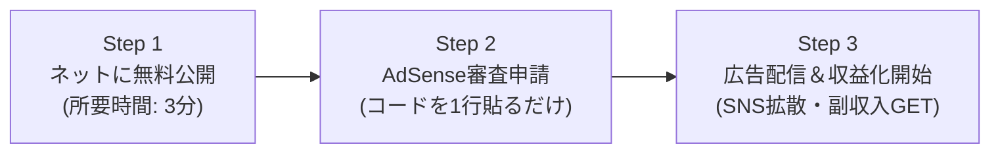

# 【保存版】一般公開＆広告収益化パーフェクトマニュアル（運営者：AOBA様専用）

このマニュアルでは、完成した「5人家族向け食費節約献立＆買い物リスト作成ツール」を**完全無料でインターネット上に一般公開し、Google AdSenseなどの広告で毎月収益（副収入）を得るまでの具体的なステップ**を解説します。

---

## 🌟 全体スケジュール（3つのステップ）

---

## Step 1: 完全無料でインターネット上に公開する（おすすめ2選）

サーバー代・ドメイン代は**一切不要（0円）**です。以下のいずれかの方法ですぐに公開できます。

### 【おすすめNo.1】Cloudflare Pages（ドラッグ＆ドロップで3分公開）
初心者の方に最も簡単でおすすめの方法です。
1. [Cloudflare（クラウドフレア）公式サイト](https://www.cloudflare.com/ja-jp/) にアクセスし、無料アカウントを作成します。
2. 管理画面の左メニューから **「Compute (Workers & Pages)」** → **「Pages」** を選択。
3. **「アセットを直接アップロード」**（Direct Upload）をクリック。
4. プロジェクト名（例: `frugal-menu-aoba` など半角英数）を入力。
5. デスクトップの **`食費節約レシピまとめ集` フォルダをそのままブラウザにドラッグ＆ドロップ**します。
6. 「デプロイ」を押すと、わずか数秒で **`https://frugal-menu-aoba.pages.dev`** のような全世界からアクセスできる専用URLが発行されます！
   - ※スマホやPCからそのURLを開けば、誰でもアプリを利用できます。

### 【おすすめNo.2】GitHub Pages（GitHubをお使いの方）
1. GitHubにログインし、新しいリポジトリ（例: `recipe-planner`）を「Public」で作成。
2. フォルダ内の全ファイル（`index.html`, `recipes.js`, `app.js`, `privacy.html` 等）をアップロード。
3. リポジトリの **Settings** → **Pages** を開き、Sourceを `main` ブランチに設定して保存。
4. 数分で `https://<ユーザー名>.github.io/<リポジトリ名>` で公開完了！

---

## Step 2: Google AdSense（アドセンス）に申請する

インターネット上に公開されたら、Google AdSenseに申請します。

### 1. Google AdSenseに無料登録
- [Google AdSense 公式サイト](https://www.google.com/intl/ja_jp/adsense/start/) にアクセスし、「利用開始」をクリック。
- Step 1で発行された公開URL（例: `https://frugal-menu-aoba.pages.dev`）を入力し、Googleアカウントでログインして申請します。

### 2. 審査用コードを貼り付ける
- 申請画面に **``** という審査用コードが表示されます。
- `index.html` の **23行目付近** にあるプレースホルダー箇所に貼り付けて上書き保存します。
- Cloudflare Pages等に再度アップロードすれば完了です。

### 3. 今回すでにクリアしている審査対策ポイント
AdSenseの審査は年々厳しくなっていますが、当ツールにはすでに審査合格に必要な条件がすべて組み込まれています：
- ✅ **プライバシーポリシー・免責事項（`privacy.html`）を完備**
- ✅ **運営者表記（AOBA様）とお問い合わせ窓口を明記**
- ✅ **オリジナリティの高い実用的なツール（全44レシピ・偏り防止・予算追従ロジック内蔵）**
- ✅ **スマホ対応の洗練されたレスポンシブデザイン**

---

## Step 3: 広告配信スタート＆アクセス数を伸ばすコツ

審査に合格すると、サイト内に自動的に広告が表示され、ユーザーがサイトを見たり広告をタップするたびに収益（日本円）が発生します。

### 1. 収益を最大化する集客方法
- **X（旧Twitter）での発信**:
  - 「大人2人＋子供3人の5人家族向けに、今週の食費7,500円ぴったりで回す献立＆買い物リストを自動で作れる無料ツールを作りました！」と投稿。
  - レシピ画像やスクショを添付すると、子育て世代や主婦層の間でリポスト（拡散）が起きやすいです。
- **Instagram・TikTok / YouTubeショート**:
  - 「食費節約」「時短家事」をテーマに、買い物リストからスーパーで食材を買うショート動画を投稿し、プロフィールのリンクにサイトURLを掲載。
- **子育てコミュニティ・LINEオープンチャット**:
  - ママ友や子育てサークルに「買い物リストがLINEにワンタップで送れるよ」と紹介。

### 2. さらに高単価なアフィリエイト広告を組み合わせる裏ワザ
Google AdSense（クリック報酬）に加えて、以下のアフィリエイト（成果報酬）を「買い物リスト」付近に貼ると、さらに大きな収益（1件あたり1,000円〜3,000円）が狙えます：
- **食材宅配サービス**（オイシックス、パルシステム、コープデリなど）
  - 「買い出しに行く時間がない日は食材宅配がおすすめ」として紹介
- **ネットスーパー**（楽天西友ネットスーパー、イオンネットスーパーなど）
  - A8.netやもしもアフィリエイト等の無料ASPに登録することで、誰でも簡単に提携・広告リンクを発行できます。

---

ご不明な点や、Cloudflare / GitHub へのアップロードで分からないことがあれば、いつでも気軽にお尋ねください！
AOBA様のサイト公開と収益化を全力でサポートいたします。
